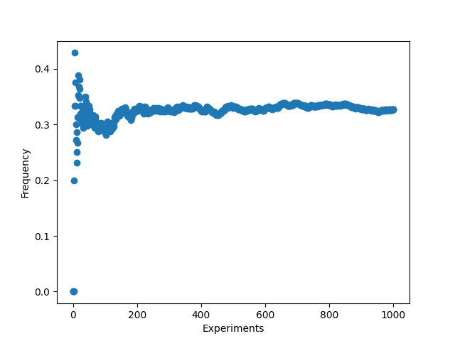
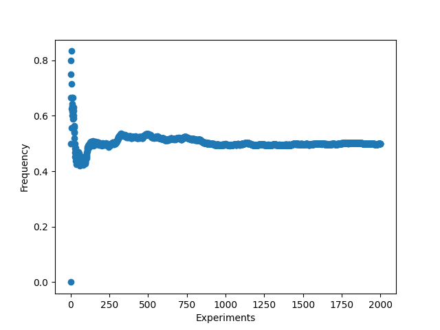
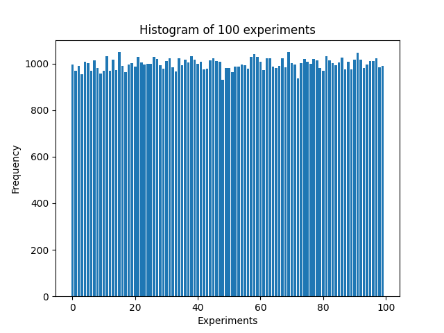

## 第二周作业

1、
$$
\begin{aligned}
A+B+C&=\Omega-A^CB^CC^C\\
&=ABC+ABC^C+AB^CC+AB^CC^C+A^CBC+A^CBC^C+A^CB^CC
\end{aligned}
$$其中每项之间互斥。

由Kolmogorov的概率论公理，
$$
P(A)=P(ABC)+P(ABC^C)+P(AB^CC)+P(AB^CC^C)\\
P(B)=P(ABC)+P(ABC^C)+P(A^CBC)+P(A^CBC^C)\\
P(C)=P(ABC)+P(AB^CC)+P(A^CBC)+P(A^CB^CC)\\
P(AB)=P(ABC)+P(ABC^C)\\
P(BC)=P(ABC)+P(A^CBC)\\
P(AC)+P(ABC)+P(AB^CC)
$$
代入公式：
$$
\begin{aligned}
LHS&=P(A)+P(B)+P(C)-P(AB)-P(BC)-P(AC)+P(ABC)\\
&=P(ABC)+P(ABC^C)+P(AB^CC)+\cdots+P(A^CB^CC)
\end{aligned}
$$

2、
对于任意事件X，
###### 1)
$$
P(X|B)=\frac{P(XB)}{P(B)}\\
P(XB)>0,P(B)>0\\
所以P(X|B)>0
$$

###### 2)
$$
\Omega B=B\\
P(\Omega|B)=\frac{P(\Omega B)}{P(B)}=\frac{P(B)}{P(B)}=1
$$

###### 3)
$$
对于A_iA_j=\varnothing,\forall i \neq j\\
\begin{aligned}
P(\sum_{i=1}^{\infty}A_i|B)&=\frac{\sum_{i=1}^{\infty}P(A_i)}{P(B)}\\
&=\sum_{i=1}^{\infty}\frac{P(A_i)}{P(B)}\\
&=\sum_{i=1}^{\infty}P(A_i|B)
\end{aligned}
$$
这样就证明了P(·|B)是概率函数

3、
######1) $P(A)\ge P(A|B)$

错误，若AB互斥，则$P(A|B)=\frac{P(AB)}{P(B)}=0$，而$P(A)$可以为一个大于0的值

######2）不存在既互斥也相互独立的事件$A,B$

正确。若$A,B$互斥，则$P(AB)=0$，而$P(A)、P(B)$可以均不为0，此时独立条件$P(AB)=P(A)P(B)$无法成立

######3）若$P(ABC) = P(A)P(B)P(C)$，则$A,B,C$独立

错误，若$C=\varnothing, P(C)=0$，则上式成立，但$A,B,C$不独立

4、
| |1|2|3|4|5|6|
|-|-|-|-|-|-|-|
|1|2|3|4|5|6|7| 
|2|3|4|5|6|7|8|
|3|4|5|6|7|8|9|
|4|5|6|7|8|9|10|
|5|6|7|8|9|10|11|
|6|7|8|9|10|11|12|

$P(A_2)=\frac{18}{36}=\frac{1}{2},P(A_3)=\frac{12}{36}=\frac{1}{3},
P(A_5)=\frac{8}{36}=\frac{2}{9}\\
P(A_2A_3)=\frac{6}{36}=\frac{1}{6},P(A_2A_5)=\frac{3}{36}=\frac{1}{12}\\
P(A_2A_3)=P(A_2)P(A_3)\\
P(A_2A_5)\neq P(A_2)P(A_5)
$
所以$A_2,A_3$是相互独立的，$A_2,A_5$不是相互独立的

5、
###### 1) 条件独立 $\not\rightarrow$ 独立
假设有2枚硬币A、B，A出现正面的概率为99%，B出现正面的概率为1%，随机取一枚硬币投掷
事件a:第一次出现正面
事件b:第二次出现正面
事件c:取的是第一枚硬币

$$P(ab)=\frac{0.99^2}{2}+\frac{0.01^2}{2}=0.4901\\
P(a)=P(b)=\frac{0.99}{2}+\frac{0.01}{2}=0.5\\
P(ab)\neq P(a)P(b)$$
所以a、b不相互独立

然而$$P(ab|c)=0.99^2=0.9801\\
P(a|c)=P(b|c)=0.99\\
P(ab|c)=P(a|c)P(b|c)$$
在条件c下，a、b条件独立

###### 2) 独立 $\not \rightarrow$ 条件独立
假设有2枚均匀硬币A、B，分别投掷2硬币
事件a:A硬币出现正面
事件b:B硬币出现反面
事件c:A、B硬币出现的面相同
$$P(a)=P(b)=0.5,P(ab)=0.5^2=P(a)P(b)$$
所以a、b相互独立
然而$$P(a|c)=P(a|c)=0.5,P(ab|c)=0\neq P(a|c)P(b|c)$$
在条件c下，a、b不条件独立

6、
记“事件A在第n轮前(包含第n轮)发生”为a
$$P(a^c)=(1-\varepsilon)^n\\
1-\varepsilon<0,\lim_{n->\infty}(1-\varepsilon)^n=0\\
P(a)=1-P(a^c)\rightarrow1，当n\rightarrow\infty$$

7、
记“随机取一张卡牌放在桌上，朝上的面为红色”为事件A
记“随机取一张卡牌放在桌上，朝上的面为红色，朝下的面为黑色“为事件B
$$P(A)=\frac{3}{6}=\frac{1}{2}\\
P(AB)=P(B)=\frac{1}{6}\\
P(B|A)=\frac{P(AB)}{P(A)}=\frac{1}{3}$$

8、这2种方式都是公平的
方案1中，任意一个人抓到“中”的概率是$\frac{1}{n}$
方案2中，第k个人要抓到“中”，则要求前面k-1个人没有抓到，且自己在剩下的签里抓到，概率为$\frac{n-1}{n}\times\frac{n-2}{n-1}\times\cdots\times\frac{n-(k-1)}{n-(k-2)}\times\frac{1}{n-(k-1)}=\frac{1}{n}$

9、
记“检查出阳性”为事件A，“小明患病”为事件B
$$
\begin{aligned}
P(B|A)&=\frac{P(A|B)P(B)}{P(A)}\\
&=\frac{P(A|B)P(B)}{P(A|B)P(B)+P(A|B^C)P(B^C)}\\
&=\frac{1\times0.6}{1\times0.6+0.3\times0.4}\\
&=\frac{0.6}{0.72}\approx83.3\%
\end{aligned}
$$
因为概率超过了80\%，所以我会推荐手术

10、
###### 1)
设$P_i$为有$i$元筹码时输光的概率，则有：
$$P_i=pP_{i+1}+(1-p)P_{i-1}$$
变形得：
$$P_{i+1}-\frac{1}{p}P_i+\frac{1-p}{p}P_{i-1}=0$$
特征方程：
$$x^2-\frac{1}{p}x+\frac{1-p}{p}=0\\
x_1=1,x_2=\frac{1-p}{p}$$
因此有：
$$
P_i=\alpha+\beta(\frac{1-p}{p})^i
$$

$$ \left\{
\begin{aligned}
P_0 & =  1 \\
P_n & =  0 \\
\end{aligned}
\right.
\\记q=\frac{1-p}{p},解得\alpha=\frac{-q^n}{1-q^n},\beta=\frac{1}{1-q^n}\\
P_k=\frac{q^k-q^n}{1-q^n}
$$

###### 2)
当$0<p<0.5，有q>1，n\rightarrow\infty时，q^k、1均为有限项，P_k\approx\frac{-q^n}{-q^n}=1$

11、
设有1个这种生物时灭亡的概率为$P$，
$$P=\frac{1}{3}\times(1+P+P^2)，解得P=1$$
所以该生物灭亡的概率为1

12、
记治愈为事件T，
若使用甲治疗方案，$P(T)=\sum_{i}P(B_iT)=\sum_{i}P(T|B_i)P(B_i)=(0.8, 0.1, 0.1)\cdot (0.8, 0.05, 0.1)=0.655$
若使用乙治疗方案，$P(T)=\sum_{i}P(B_iT)=\sum_{i}P(T|B_i)P(B_i)=(0.8, 0.1, 0.1)\cdot (0.6, 0.9, 0.9)=0.66$
乙方案的治愈率比甲方案高，我会建议乙方案。甲方案也可以被建议，原因在于它的治愈率与乙方案接近，而且对病症A的治愈率显著高于乙方案

13、
###### 1）
由全概率公式：
$$
P(B_1)=\frac{1}{2}\times\frac{4}{5}+\frac{1}{2}\times\frac{2}{5}=0.6
$$

###### 2)
若放回：
$$P(B_2)=P(B_1)=0.6$$
若不放回：
$$
\begin{aligned}
P(B_2)&=(\frac{1}{2}, \frac{1}{2})\cdot((\frac{4}{5}, \frac{1}{5})\cdot(\frac{3}{4}, \frac{4}{4}), (\frac{2}{5}, \frac{3}{5})\cdot(\frac{1}{4}, \frac{2}{4}))\\
&=(\frac{1}{2}, \frac{1}{2})\cdot(\frac{4}{5}, \frac{2}{5})\\
&=\frac{3}{5}
\end{aligned}
$$
放回与不放回摸到黑球的概率是一样的，因为并未从之前的过程中获得能产生影响的信息，第二次摸的球为黑与第一次摸的球为黑本质上没有区别

###### 3）
$$
P(B_2|B_1)=\frac{P(B_2B_1)}{P(B_1)}=\frac{\frac{1}{2}\times((\frac{4}{5})^2+(\frac{2}{5})^2)}{0.6}=\frac{2}{3}$$
$P(B_2|B_1)>P(B_2)$，因为已知第一个球为黑球，这使取得1号袋的可能性增加了

###### 4)
$$
P(B_1B_2\cdots B_n)=\frac{1}{2}\times((\frac{4}{5})^n+(\frac{2}{5})^n)\\
\begin{aligned}
P(B_{n+1}|B_1\cdots B_n)&=\frac{\frac{1}{2}\times((\frac{4}{5})^{n+1}+(\frac{2}{5})^{n+1})}{\frac{1}{2}\times((\frac{4}{5})^n+(\frac{2}{5})^n)}\\
&=\frac{(\frac{4}{5})^{n+1}+(\frac{2}{5})^{n+1}}{(\frac{4}{5})^n+(\frac{2}{5})^n}\\
&=\frac{\frac{4}{5}+(\frac{1}{2})^n\times\frac{2}{5}}{1+(\frac{1}{2})^n}\\
& \approx \frac{4}{5}，当n\rightarrow\infty
\end{aligned}
$$
可以理解为当前面一直出现黑球，几乎能断定取的是1号袋

###### 5）
记取1号袋为事件A
$$
\begin{aligned}
P(A|B_1\cdots B_n)&=\frac{P(B_1\cdots B_n|A)P(A)}{P(B_1\cdots B_n)}\\
&=\frac{(\frac{4}{5})^n\times0.5}{\frac{1}{2}\times((\frac{4}{5})^n+(\frac{2}{5})^n)}\\
&=\frac{(\frac{4}{5})^n}{(\frac{4}{5})^n+(\frac{2}{5})^n}\\
&\approx1，当n\rightarrow\infty
\end{aligned}
$$
当1到n次都取得黑球，几乎可以断定取得的是1号袋

14、
###### 1)
我选甲，单独选择一个对手无必胜策略

###### 2）
$$
5\times(1-P_甲(B))-20\times P_甲(B)=0\\
P_甲(B)=0.2\\
-15\times P_乙(A)+10\times(1-P_乙(A))=0\\
P_乙(A)=0.4
$$
$P_甲(B)+P_乙(A)=0.6<1$，这说明甲乙都自信自身能够赢，可以通过对冲寻找到必胜策略

15、
###### 1）散点图：

###### 2) 100正面朝上直方图

###### 3)
100次实验平均值为299.43，与$np=300$非常接近

###### 4)尝试$p=0.5, n=2000$

